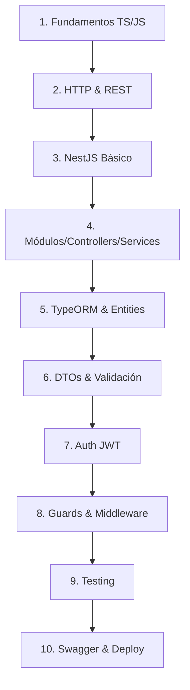

# 🚀 Roadmap Completo: Backend con NestJS

> **Guía completa para nuevos integrantes del equipo**
>
> Este documento te llevará desde los fundamentos hasta dominar el desarrollo backend con NestJS. Está diseñado para que cualquier desarrollador, sin importar su experiencia previa, pueda entender y contribuir al proyecto.

---

## 📚 Tabla de Contenidos

1. [Fundamentos Previos Requeridos](#-1-fundamentos-previos-requeridos)
2. [Introducción a NestJS](#-2-introducción-a-nestjs)
3. [Arquitectura y Patrones](#-3-arquitectura-y-patrones)
4. [Módulos y Estructura del Proyecto](#-4-módulos-y-estructura-del-proyecto)
5. [Controladores y Rutas](#-5-controladores-y-rutas)
6. [Servicios y Lógica de Negocio](#-6-servicios-y-lógica-de-negocio)
7. [TypeORM y Base de Datos](#-7-typeorm-y-base-de-datos)
8. [DTOs y Validación](#-8-dtos-y-validación)
9. [Autenticación y Autorización](#-9-autenticación-y-autorización)
10. [Documentación con Swagger](#-10-documentación-con-swagger)
11. [Testing](#-11-testing)
12. [Herramientas del Proyecto](#-12-herramientas-del-proyecto)
13. [Recursos Adicionales](#-13-recursos-adicionales)

---

## 📖 1. Fundamentos Previos Requeridos

Antes de sumergirte en NestJS, necesitas tener conocimientos sólidos en:

### 1.1 JavaScript/ES6+

| Concepto            | Descripción                    | Importancia |
| ------------------- | ------------------------------ | ----------- |
| **Arrow Functions** | `const fn = () => {}`          | ⭐⭐⭐ Alta |
| **Destructuring**   | `const { a, b } = obj`         | ⭐⭐⭐ Alta |
| **Spread Operator** | `{ ...obj, newProp }`          | ⭐⭐⭐ Alta |
| **Promises**        | Manejo asíncrono               | ⭐⭐⭐ Alta |
| **Async/Await**     | Sintaxis moderna para Promises | ⭐⭐⭐ Alta |
| **Clases ES6**      | `class MyClass {}`             | ⭐⭐⭐ Alta |
| **Módulos ES6**     | `import/export`                | ⭐⭐⭐ Alta |

### 1.2 TypeScript

TypeScript es **obligatorio** para NestJS. Conceptos clave:

```typescript
// Tipos básicos
const nombre: string = 'Juan';
const edad: number = 25;
const activo: boolean = true;

// Interfaces - Definen la forma de un objeto
interface Usuario {
  id: string;
  email: string;
  nombre: string;
  rol?: string; // Propiedad opcional
}

// Tipos genéricos - Flexibilidad con tipos
function buscar<T>(items: T[], condicion: (item: T) => boolean): T | undefined {
  return items.find(condicion);
}

// Decoradores - Funciones que modifican clases/métodos
// NestJS los usa MUCHO
@Controller('usuarios') // Decorador de clase
class UsuariosController {
  @Get() // Decorador de método
  obtenerTodos() {}
}
```

### 1.3 Node.js Basics

- Event Loop y cómo funciona Node.js
- NPM/pnpm para gestión de paquetes
- Módulos CommonJS vs ES Modules
- Variables de entorno (`process.env`)

### 1.4 HTTP y REST APIs

| Método   | Acción CRUD | Ejemplo             |
| -------- | ----------- | ------------------- |
| `GET`    | Read        | Obtener productos   |
| `POST`   | Create      | Crear producto      |
| `PUT`    | Update      | Actualizar producto |
| `DELETE` | Delete      | Eliminar producto   |

**Status Codes importantes:**

- `200` - OK
- `201` - Created
- `400` - Bad Request
- `401` - Unauthorized
- `403` - Forbidden
- `404` - Not Found
- `500` - Internal Server Error

---

## 🏠 2. Introducción a NestJS

### 2.1 ¿Qué es NestJS?

**NestJS** es un framework progresivo para Node.js que permite construir aplicaciones backend escalables y mantenibles. Está construido con TypeScript y combina elementos de:

- **OOP** (Programación Orientada a Objetos)
- **FP** (Programación Funcional)
- **FRP** (Programación Reactiva Funcional)

### 2.2 ¿Por qué NestJS?

| Característica                | Beneficio                          |
| ----------------------------- | ---------------------------------- |
| **Arquitectura modular**      | Código organizado y mantenible     |
| **Inyección de dependencias** | Facilita testing y desacoplamiento |
| **TypeScript nativo**         | Tipado estático, mejor DX          |
| **Extensible**                | Fácil integración con librerías    |
| **CLI potente**               | Genera código automáticamente      |
| **Documentación excelente**   | Curva de aprendizaje suave         |

### 2.3 Estructura Básica

Un proyecto NestJS se organiza así:

```
server/
├── src/
│   ├── main.ts              # 🚀 Punto de entrada
│   ├── app.module.ts        # 📦 Módulo raíz
│   ├── auth/                # 🔐 Feature: Autenticación
│   │   ├── auth.module.ts
│   │   ├── auth.controller.ts
│   │   ├── auth.service.ts
│   │   ├── dto/
│   │   └── entities/
│   ├── productos/           # 📦 Feature: Productos
│   │   └── ...
│   └── clientes/            # 👥 Feature: Clientes
│       └── ...
├── test/                    # 🧪 Tests
├── .env                     # 🔧 Variables de entorno
└── package.json             # 📋 Dependencias
```

---

## 🏗️ 3. Arquitectura y Patrones

### 3.1 Patrón MVC (Model-View-Controller)

NestJS implementa una variación del patrón MVC:

```
               ┌─────────────────┐
               │    Controller   │  ← Recibe requests HTTP
               │   (Routes/API)  │
               └────────┬────────┘
                        │
               ┌────────▼────────┐
               │     Service     │  ← Lógica de negocio
               │ (Business Logic)│
               └────────┬────────┘
                        │
               ┌────────▼────────┐
               │   Repository    │  ← Acceso a datos
               │   (TypeORM)     │
               └────────┬────────┘
                        │
               ┌────────▼────────┐
               │    Database     │  ← MySQL
               └─────────────────┘
```

### 3.2 Inyección de Dependencias (DI)

Es el **concepto más importante** de NestJS. En lugar de crear instancias manualmente:

```typescript
// ❌ SIN inyección de dependencias
class ProductosController {
  private productosService: ProductosService;

  constructor() {
    this.productosService = new ProductosService(); // ¡MAL!
  }
}

// ✅ CON inyección de dependencias (NestJS way)
@Controller('productos')
class ProductosController {
  constructor(private readonly productosService: ProductosService) {
    // NestJS automáticamente crea e inyecta ProductosService
  }
}
```

**¿Por qué es mejor?**

- El código es más testeable (puedes inyectar mocks)
- Menos acoplamiento entre componentes
- NestJS maneja el ciclo de vida de las instancias

### 3.3 Decoradores

Los decoradores son funciones especiales que modifican clases, métodos o propiedades:

```typescript
@Controller('productos')    // Define que esta clase maneja rutas /productos
@Injectable()              // Marca la clase como inyectable
@Get()                     // Define método como endpoint GET
@Post()                    // Define método como endpoint POST
@Body()                    // Extrae el body del request
@Param('id')              // Extrae parámetro de la URL
@UseGuards()              // Aplica guards de seguridad
```

---

## 📦 4. Módulos y Estructura del Proyecto

### 4.1 ¿Qué es un Módulo?

Un módulo es una clase decorada con `@Module()` que organiza un conjunto relacionado de funcionalidades.

```typescript
// productos.module.ts
import { Module } from '@nestjs/common';
import { TypeOrmModule } from '@nestjs/typeorm';
import { ProductosController } from './productos.controller';
import { ProductosService } from './productos.service';
import { Producto } from './entities/producto.entity';

@Module({
  imports: [TypeOrmModule.forFeature([Producto])], // Dependencias de otros módulos
  controllers: [ProductosController], // Controllers de este módulo
  providers: [ProductosService], // Services/Providers
  exports: [ProductosService], // Lo que otros módulos pueden usar
})
export class ProductosModule {}
```

### 4.2 Módulo Raíz (AppModule)

Es el punto de entrada que importa todos los demás módulos:

```typescript
// app.module.ts
@Module({
  imports: [
    ConfigModule.forRoot({ isGlobal: true }),  // Variables de entorno
    TypeOrmModule.forRootAsync({...}),         // Conexión a BD
    AuthModule,                                 // Feature modules
    ProductosModule,
    ClientesModule,
    CategoriasModule,
  ],
})
export class AppModule {}
```

### 4.3 Estructura de un Feature Module

Cada feature debería tener esta estructura:

```
productos/
├── dto/                          # Data Transfer Objects
│   └── producto.dto.ts
├── entities/                     # Entidades TypeORM
│   └── producto.entity.ts
├── productos.controller.ts       # Endpoints HTTP
├── productos.service.ts          # Lógica de negocio
├── productos.module.ts           # Definición del módulo
└── productos.controller.spec.ts  # Tests (opcional)
```

---

## 🎮 5. Controladores y Rutas

### 5.1 ¿Qué es un Controller?

Un controller maneja las peticiones HTTP entrantes y retorna respuestas.

```typescript
// productos.controller.ts
import {
  Controller,
  Get,
  Post,
  Put,
  Delete,
  Body,
  Param,
  UseGuards,
} from '@nestjs/common';
import { AuthGuard } from '@nestjs/passport';
import { ProductosService } from './productos.service';
import { CreateProductoDto, UpdateProductoDto } from './dto/producto.dto';

@Controller('productos') // Base URL: /productos
export class ProductosController {
  constructor(private readonly productosService: ProductosService) {}

  // GET /productos
  @Get()
  findAll() {
    return this.productosService.findAll();
  }

  // GET /productos/:id
  @Get(':id')
  findOne(@Param('id') id: string) {
    return this.productosService.findOne(id);
  }

  // POST /productos (protegido)
  @Post()
  @UseGuards(AuthGuard('jwt'))
  create(@Body() createProductoDto: CreateProductoDto) {
    return this.productosService.create(createProductoDto);
  }

  // PUT /productos/:id (protegido)
  @Put(':id')
  @UseGuards(AuthGuard('jwt'))
  update(
    @Param('id') id: string,
    @Body() updateProductoDto: UpdateProductoDto,
  ) {
    return this.productosService.update(id, updateProductoDto);
  }

  // DELETE /productos/:id (protegido)
  @Delete(':id')
  @UseGuards(AuthGuard('jwt'))
  remove(@Param('id') id: string) {
    return this.productosService.remove(id);
  }
}
```

### 5.2 Decoradores de Rutas

| Decorador        | Método HTTP | Ejemplo de URL      |
| ---------------- | ----------- | ------------------- |
| `@Get()`         | GET         | `/productos`        |
| `@Get(':id')`    | GET         | `/productos/abc123` |
| `@Post()`        | POST        | `/productos`        |
| `@Put(':id')`    | PUT         | `/productos/abc123` |
| `@Delete(':id')` | DELETE      | `/productos/abc123` |
| `@Patch(':id')`  | PATCH       | `/productos/abc123` |

### 5.3 Decoradores de Parámetros

```typescript
@Get('search')
buscar(
  @Query('nombre') nombre: string,      // /productos/search?nombre=cemento
  @Query('categoria') categoria: string, // /productos/search?categoria=construccion
  @Headers('authorization') token: string, // Header Authorization
) {
  return this.productosService.buscar(nombre, categoria);
}

@Post()
crear(
  @Body() dto: CreateProductoDto,       // Todo el body
  @Body('nombre') nombre: string,        // Solo una propiedad
) {
  return this.productosService.crear(dto);
}
```

---

## ⚙️ 6. Servicios y Lógica de Negocio

### 6.1 ¿Qué es un Service?

Un service contiene la **lógica de negocio**. Es donde ocurre el trabajo real.

```typescript
// productos.service.ts
import { Injectable, NotFoundException } from '@nestjs/common';
import { InjectRepository } from '@nestjs/typeorm';
import { Repository } from 'typeorm';
import { Producto } from './entities/producto.entity';
import { CreateProductoDto, UpdateProductoDto } from './dto/producto.dto';

@Injectable() // ¡Importante! Permite la inyección de dependencias
export class ProductosService {
  constructor(
    @InjectRepository(Producto)
    private productosRepository: Repository<Producto>,
  ) {}

  async findAll(): Promise<Producto[]> {
    return this.productosRepository.find({
      relations: ['categoria'], // Incluye la relación
      order: { created_at: 'DESC' }, // Ordena por fecha
    });
  }

  async findOne(id: string): Promise<Producto> {
    const producto = await this.productosRepository.findOne({
      where: { id },
      relations: ['categoria'],
    });

    if (!producto) {
      throw new NotFoundException(`Producto con ID ${id} no encontrado`);
    }

    return producto;
  }

  async create(createProductoDto: CreateProductoDto): Promise<Producto> {
    const producto = this.productosRepository.create(createProductoDto);
    return this.productosRepository.save(producto);
  }

  async update(
    id: string,
    updateProductoDto: UpdateProductoDto,
  ): Promise<Producto> {
    const producto = await this.findOne(id);
    Object.assign(producto, updateProductoDto);
    return this.productosRepository.save(producto);
  }

  async remove(id: string): Promise<void> {
    const producto = await this.findOne(id);
    await this.productosRepository.remove(producto);
  }
}
```

### 6.2 Excepciones HTTP

NestJS provee excepciones predefinidas:

```typescript
import {
  NotFoundException, // 404
  BadRequestException, // 400
  UnauthorizedException, // 401
  ForbiddenException, // 403
  ConflictException, // 409
  InternalServerErrorException, // 500
} from '@nestjs/common';

// Uso:
throw new NotFoundException('Producto no encontrado');
throw new BadRequestException('Datos inválidos');
throw new UnauthorizedException('Token inválido');
```

---

## 🗃️ 7. TypeORM y Base de Datos

### 7.1 ¿Qué es TypeORM?

TypeORM es un **ORM (Object-Relational Mapping)** que permite interactuar con la base de datos usando objetos TypeScript en lugar de SQL directo.

### 7.2 Configuración

```typescript
// app.module.ts
TypeOrmModule.forRootAsync({
  imports: [ConfigModule],
  useFactory: (configService: ConfigService) => ({
    type: 'mysql',
    host: configService.get('DB_HOST', 'localhost'),
    port: configService.get<number>('DB_PORT', 3306),
    username: configService.get('DB_USERNAME', 'root'),
    password: configService.get('DB_PASSWORD', 'root'),
    database: configService.get('DB_DATABASE', 'corralon'),
    entities: [__dirname + '/**/*.entity{.ts,.js}'],
    synchronize: false,  // ⚠️ false en producción, usar migrations
  }),
  inject: [ConfigService],
}),
```

### 7.3 Entidades

Una entidad representa una tabla en la base de datos:

```typescript
// producto.entity.ts
import {
  Entity,
  Column,
  PrimaryColumn,
  CreateDateColumn,
  UpdateDateColumn,
  ManyToOne,
  JoinColumn,
} from 'typeorm';
import { Categoria } from '../../categorias/entities/categoria.entity';

@Entity('productos') // Nombre de la tabla
export class Producto {
  @PrimaryColumn('uuid')
  id: string;

  @Column({ length: 100 })
  codigo: string;

  @Column({ length: 200 })
  nombre: string;

  @Column('text', { nullable: true })
  descripcion: string;

  @Column('decimal', { precision: 10, scale: 2, default: 0 })
  precio_venta: number;

  @Column({ default: true })
  activo: boolean;

  @Column('uuid', { nullable: true })
  categoria_id: string;

  // Relación Many-to-One: Muchos productos pertenecen a UNA categoría
  @ManyToOne(() => Categoria)
  @JoinColumn({ name: 'categoria_id' })
  categoria: Categoria;

  @CreateDateColumn()
  created_at: Date;

  @UpdateDateColumn()
  updated_at: Date;
}
```

### 7.4 Tipos de Relaciones

```typescript
// ONE-TO-MANY: Una categoría tiene MUCHOS productos
@Entity('categorias')
export class Categoria {
  @OneToMany(() => Producto, (producto) => producto.categoria)
  productos: Producto[];
}

// MANY-TO-ONE: Muchos productos pertenecen a UNA categoría
@Entity('productos')
export class Producto {
  @ManyToOne(() => Categoria, (categoria) => categoria.productos)
  @JoinColumn({ name: 'categoria_id' })
  categoria: Categoria;
}

// ONE-TO-ONE: Un usuario tiene UN perfil
@Entity('users')
export class User {
  @OneToOne(() => Profile)
  @JoinColumn({ name: 'id' })
  profile: Profile;
}

// MANY-TO-MANY: Muchos productos pueden estar en MUCHOS pedidos
@Entity('productos')
export class Producto {
  @ManyToMany(() => Pedido, (pedido) => pedido.productos)
  pedidos: Pedido[];
}
```

### 7.5 Repository Pattern

TypeORM provee métodos útiles:

```typescript
// Métodos del Repository
const productos = await repository.find(); // SELECT * FROM productos
const producto = await repository.findOne({ where: { id } }); // SELECT * WHERE id = ?
const nuevo = repository.create(dto); // Crea instancia (no guarda)
await repository.save(producto); // INSERT o UPDATE
await repository.remove(producto); // DELETE
await repository.update(id, { nombre: 'Nuevo' }); // UPDATE directo

// Queries más complejas con QueryBuilder
const resultado = await repository
  .createQueryBuilder('p')
  .where('p.precio > :min', { min: 100 })
  .andWhere('p.activo = :activo', { activo: true })
  .orderBy('p.nombre', 'ASC')
  .getMany();
```

---

## 📋 8. DTOs y Validación

### 8.1 ¿Qué es un DTO?

**DTO (Data Transfer Object)** define la estructura y validación de los datos que entran y salen de la API.

```typescript
// dto/producto.dto.ts
import {
  IsString,
  IsNumber,
  IsOptional,
  IsUUID,
  Min,
  MaxLength,
} from 'class-validator';
import { ApiProperty, PartialType } from '@nestjs/swagger';

export class CreateProductoDto {
  @ApiProperty({ example: 'CEM001', description: 'Código único del producto' })
  @IsString()
  @MaxLength(100)
  codigo: string;

  @ApiProperty({ example: 'Cemento Portland 50kg' })
  @IsString()
  @MaxLength(200)
  nombre: string;

  @ApiProperty({ example: 'Cemento de alta resistencia', required: false })
  @IsOptional()
  @IsString()
  descripcion?: string;

  @ApiProperty({ example: 1500.5 })
  @IsNumber()
  @Min(0)
  precio_venta: number;

  @ApiProperty({ example: 'uuid-de-categoria', required: false })
  @IsOptional()
  @IsUUID()
  categoria_id?: string;
}

// PartialType hace todas las propiedades opcionales (para UPDATE)
export class UpdateProductoDto extends PartialType(CreateProductoDto) {}
```

### 8.2 Validadores Disponibles

```typescript
// Strings
@IsString()         // Es string
@IsNotEmpty()       // No vacío
@MaxLength(200)     // Máximo 200 caracteres
@MinLength(3)       // Mínimo 3 caracteres
@IsEmail()          // Es email válido
@Matches(/regex/)   // Cumple regex

// Números
@IsNumber()         // Es número
@IsInt()            // Es entero
@Min(0)             // Mínimo 0
@Max(100)           // Máximo 100
@IsPositive()       // Mayor a 0

// Otros
@IsBoolean()        // Es boolean
@IsDate()           // Es fecha
@IsUUID()           // Es UUID válido
@IsOptional()       // Puede no venir
@IsArray()          // Es array
@IsEnum(MyEnum)     // Es valor del enum

// Objetos anidados
@ValidateNested()
@Type(() => OtroDto)
objeto: OtroDto;
```

### 8.3 ValidationPipe Global

```typescript
// main.ts
app.useGlobalPipes(
  new ValidationPipe({
    whitelist: true, // Remueve propiedades no definidas en el DTO
    transform: true, // Transforma tipos automáticamente
    forbidNonWhitelisted: true, // Error si vienen propiedades extra
  }),
);
```

---

## 🔐 9. Autenticación y Autorización

### 9.1 Flujo de Autenticación JWT

```
1. Usuario envía email/password → POST /auth/login
2. Backend valida credenciales
3. Si válido → Genera JWT token
4. Usuario guarda token
5. Requests posteriores → Header: Authorization: Bearer <token>
6. Guard valida token en cada request protegido
```

### 9.2 JWT Strategy

```typescript
// jwt.strategy.ts
import { Injectable } from '@nestjs/common';
import { PassportStrategy } from '@nestjs/passport';
import { ExtractJwt, Strategy } from 'passport-jwt';
import { ConfigService } from '@nestjs/config';

@Injectable()
export class JwtStrategy extends PassportStrategy(Strategy) {
  constructor(private configService: ConfigService) {
    super({
      jwtFromRequest: ExtractJwt.fromAuthHeaderAsBearerToken(),
      ignoreExpiration: false,
      secretOrKey: configService.get('JWT_SECRET'),
    });
  }

  async validate(payload: any) {
    // El payload contiene lo que pusimos al crear el token
    return { userId: payload.sub, email: payload.email, rol: payload.rol };
  }
}
```

### 9.3 Proteger Endpoints

```typescript
import { UseGuards } from '@nestjs/common';
import { AuthGuard } from '@nestjs/passport';

@Controller('productos')
export class ProductosController {
  // Endpoint público
  @Get()
  findAll() { ... }

  // Endpoint protegido - requiere JWT válido
  @Post()
  @UseGuards(AuthGuard('jwt'))
  create(@Body() dto: CreateProductoDto) { ... }
}
```

### 9.4 Auth Service (Login/Register)

```typescript
// auth.service.ts
@Injectable()
export class AuthService {
  constructor(
    @InjectRepository(User)
    private usersRepository: Repository<User>,
    private jwtService: JwtService,
  ) {}

  async login(loginDto: LoginDto) {
    const { email, password } = loginDto;

    // 1. Buscar usuario
    const user = await this.usersRepository.findOne({ where: { email } });
    if (!user) {
      throw new UnauthorizedException('Credenciales inválidas');
    }

    // 2. Verificar password
    const isPasswordValid = await bcrypt.compare(password, user.password);
    if (!isPasswordValid) {
      throw new UnauthorizedException('Credenciales inválidas');
    }

    // 3. Generar token
    const payload = { sub: user.id, email: user.email, rol: user.rol };
    return {
      access_token: this.jwtService.sign(payload),
      user: { id: user.id, email: user.email, rol: user.rol },
    };
  }

  async register(registerDto: RegisterDto) {
    const { email, password, nombre } = registerDto;

    // 1. Verificar que no existe
    const existingUser = await this.usersRepository.findOne({
      where: { email },
    });
    if (existingUser) {
      throw new UnauthorizedException('El email ya está registrado');
    }

    // 2. Hash del password
    const hashedPassword = await bcrypt.hash(password, 10);

    // 3. Crear usuario
    const user = this.usersRepository.create({
      id: uuidv4(),
      email,
      password: hashedPassword,
    });
    await this.usersRepository.save(user);

    // 4. Generar token
    const payload = { sub: user.id, email: user.email };
    return {
      access_token: this.jwtService.sign(payload),
      user: { id: user.id, email: user.email },
    };
  }
}
```

---

## 📖 10. Documentación con Swagger

### 10.1 Configuración

```typescript
// main.ts
import { SwaggerModule, DocumentBuilder } from '@nestjs/swagger';

const config = new DocumentBuilder()
  .setTitle('Corralón API')
  .setDescription('API para gestión de corralón de materiales')
  .setVersion('1.0')
  .addBearerAuth() // Habilita autenticación JWT en Swagger
  .build();

const document = SwaggerModule.createDocument(app, config);
SwaggerModule.setup('api', app, document); // Disponible en /api
```

### 10.2 Decoradores de Documentación

```typescript
import { ApiTags, ApiOperation, ApiResponse, ApiBearerAuth, ApiProperty } from '@nestjs/swagger';

@ApiTags('productos')  // Agrupa endpoints
@Controller('productos')
export class ProductosController {

  @Get()
  @ApiOperation({ summary: 'Obtener todos los productos' })
  @ApiResponse({ status: 200, description: 'Lista de productos retornada' })
  findAll() { ... }

  @Post()
  @ApiOperation({ summary: 'Crear un nuevo producto' })
  @ApiResponse({ status: 201, description: 'Producto creado exitosamente' })
  @ApiResponse({ status: 400, description: 'Datos inválidos' })
  @ApiResponse({ status: 401, description: 'No autorizado' })
  @ApiBearerAuth()  // Indica que requiere auth
  create(@Body() dto: CreateProductoDto) { ... }
}

// En los DTOs
export class CreateProductoDto {
  @ApiProperty({
    example: 'CEM001',
    description: 'Código único del producto',
    maxLength: 100,
  })
  @IsString()
  codigo: string;
}
```

### 10.3 Acceder a Swagger

Una vez el servidor está corriendo: **http://localhost:3001/api**

---

## 🧪 11. Testing

### 11.1 Tipos de Tests

| Tipo                  | Qué testea                 | Herramienta           |
| --------------------- | -------------------------- | --------------------- |
| **Unit Tests**        | Funciones/métodos aislados | Jest                  |
| **Integration Tests** | Módulos trabajando juntos  | Jest + Testing Module |
| **E2E Tests**         | API completa               | Jest + Supertest      |

### 11.2 Unit Test Ejemplo

```typescript
// productos.service.spec.ts
import { Test, TestingModule } from '@nestjs/testing';
import { ProductosService } from './productos.service';
import { getRepositoryToken } from '@nestjs/typeorm';
import { Producto } from './entities/producto.entity';

describe('ProductosService', () => {
  let service: ProductosService;

  const mockRepository = {
    find: jest.fn(),
    findOne: jest.fn(),
    create: jest.fn(),
    save: jest.fn(),
    remove: jest.fn(),
  };

  beforeEach(async () => {
    const module: TestingModule = await Test.createTestingModule({
      providers: [
        ProductosService,
        {
          provide: getRepositoryToken(Producto),
          useValue: mockRepository,
        },
      ],
    }).compile();

    service = module.get<ProductosService>(ProductosService);
  });

  it('should be defined', () => {
    expect(service).toBeDefined();
  });

  describe('findAll', () => {
    it('should return array of productos', async () => {
      const productos = [{ id: '1', nombre: 'Cemento' }];
      mockRepository.find.mockResolvedValue(productos);

      const result = await service.findAll();

      expect(result).toEqual(productos);
      expect(mockRepository.find).toHaveBeenCalled();
    });
  });
});
```

### 11.3 E2E Test Ejemplo

```typescript
// test/app.e2e-spec.ts
import { Test, TestingModule } from '@nestjs/testing';
import { INestApplication } from '@nestjs/common';
import * as request from 'supertest';
import { AppModule } from '../src/app.module';

describe('AppController (e2e)', () => {
  let app: INestApplication;

  beforeEach(async () => {
    const moduleFixture: TestingModule = await Test.createTestingModule({
      imports: [AppModule],
    }).compile();

    app = moduleFixture.createNestApplication();
    await app.init();
  });

  it('/productos (GET)', () => {
    return request(app.getHttpServer())
      .get('/productos')
      .expect(200)
      .expect((res) => {
        expect(Array.isArray(res.body)).toBe(true);
      });
  });

  afterAll(async () => {
    await app.close();
  });
});
```

### 11.4 Ejecutar Tests

```bash
# Unit tests
pnpm run test

# Watch mode
pnpm run test:watch

# E2E tests
pnpm run test:e2e

# Coverage
pnpm run test:cov
```

---

## 🛠️ 12. Herramientas del Proyecto

### 12.1 Stack Tecnológico

| Categoría      | Tecnología      | Versión | Propósito               |
| -------------- | --------------- | ------- | ----------------------- |
| **Framework**  | NestJS          | 11.x    | Backend framework       |
| **Language**   | TypeScript      | 5.x     | Tipado estático         |
| **Runtime**    | Node.js         | 18+     | Entorno de ejecución    |
| **Database**   | MySQL           | 8.x     | Base de datos           |
| **ORM**        | TypeORM         | 0.3.x   | Mapeo objeto-relacional |
| **Auth**       | Passport JWT    | 4.x     | Autenticación           |
| **Validation** | class-validator | 0.14.x  | Validación de DTOs      |
| **Docs**       | Swagger         | 11.x    | Documentación de API    |
| **Testing**    | Jest            | 30.x    | Framework de testing    |
| **Linting**    | ESLint          | 9.x     | Calidad de código       |
| **Formatting** | Prettier        | 3.x     | Formateo de código      |

### 12.2 Comandos Útiles

```bash
# Desarrollo
pnpm run start:dev      # Inicia con hot-reload
pnpm run build          # Compila a JavaScript
pnpm run start:prod     # Ejecuta build de producción

# Código
pnpm run lint           # Verifica errores de linting
pnpm run format         # Formatea código con Prettier

# NestJS CLI - Generación de código
nest g module productos        # Genera módulo
nest g controller productos    # Genera controller
nest g service productos       # Genera service
nest g resource usuarios       # Genera CRUD completo

# Testing
pnpm run test           # Ejecuta tests unitarios
pnpm run test:e2e       # Ejecuta tests end-to-end
pnpm run test:cov       # Genera reporte de cobertura
```

### 12.3 Variables de Entorno

```env
# .env
DB_HOST=localhost
DB_PORT=3306
DB_USERNAME=root
DB_PASSWORD=tupassword
DB_DATABASE=corralon

JWT_SECRET=una_clave_secreta_muy_larga_y_segura
JWT_EXPIRES_IN=7d
```

### 12.4 Extensiones VSCode Recomendadas

- **ESLint** - Linting en tiempo real
- **Prettier** - Formateo automático
- **NestJS Snippets** - Snippets útiles para NestJS
- **TypeScript Hero** - Importaciones automáticas
- **MySQL** - Cliente de base de datos
- **REST Client** - Probar API desde VSCode
- **GitLens** - Mejor integración con Git

---

## 📚 13. Recursos Adicionales

### 13.1 Documentación Oficial

- 📖 [NestJS Docs](https://docs.nestjs.com/) - Documentación completa
- 📖 [TypeORM Docs](https://typeorm.io/) - Guía de TypeORM
- 📖 [TypeScript Handbook](https://www.typescriptlang.org/docs/) - Referencia de TS

### 13.2 Tutoriales Recomendados

- 🎥 [NestJS Crash Course - Traversy Media](https://www.youtube.com/results?search_query=nestjs+crash+course)
- 🎥 [NestJS + TypeORM - Marius Espejo](https://www.youtube.com/results?search_query=nestjs+typeorm+tutorial)
- 📝 [Building a REST API with NestJS](https://www.freecodecamp.org/news/build-a-crud-application-with-nestjs/)

### 13.3 Patrones y Mejores Prácticas

- Siempre usar DTOs para validación de entrada
- Separar lógica de negocio en Services
- Usar Guards para autenticación
- Implementar excepciones HTTP apropiadas
- Documentar con Swagger/OpenAPI
- Escribir tests unitarios para services
- Usar variables de entorno para configuración

### 13.4 Orden de Aprendizaje Sugerido



---

## ✅ Checklist del Nuevo Integrante

Antes de empezar a contribuir, asegúrate de:

- [ ] Tener Node.js 18+ instalado
- [ ] Tener MySQL 8+ instalado y configurado
- [ ] Clonar el repositorio
- [ ] Configurar el archivo `.env`
- [ ] Ejecutar los scripts SQL de base de datos
- [ ] Instalar dependencias con `pnpm install`
- [ ] Poder ejecutar `pnpm run start:dev` sin errores
- [ ] Acceder a Swagger en http://localhost:3001/api
- [ ] Entender la estructura de carpetas del proyecto
- [ ] Leer este documento completo 📖

---

## 🆘 ¿Necesitas Ayuda?

1. **Revisa la documentación de NestJS**: La mayoría de las preguntas están respondidas ahí
2. **Busca en el código existente**: Hay ejemplos de todo en el proyecto
3. **Consulta al equipo**: No dudes en preguntar a tus compañeros

---

> **¡Bienvenido al equipo!** 🎉
>
> No te preocupes si al principio parece mucho. Empieza con lo básico, practica con el código existente, y poco a poco irás dominando todos estos conceptos.

---

_Última actualización: Diciembre 2025_
_Desarrollado para Sistema Corralón ERP_ 🏗️
